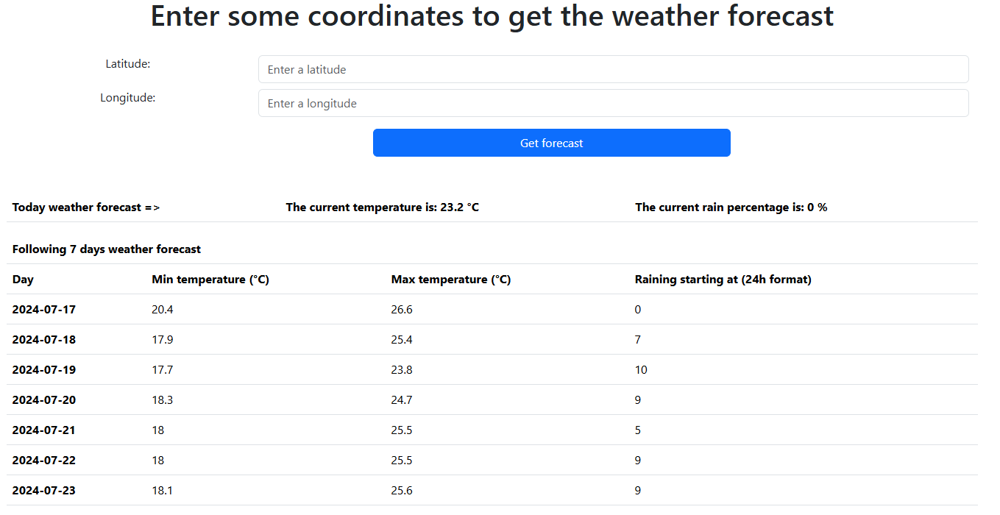

# Weather Forecast

A weather forecast web app based on latitude and longitude provided by the user. 




This project uses the `Open-Meteo Weather Forecast API` and the related API documentation is [here](https://open-meteo.com/en/docs).

## How to run

For ease, this page is hosted [here]().

If you want to run the project locally, you have to follow the next steps:

- Install `Node.js`.
- Head over to the project directory and open a terminal.
- Inside that terminal, run the following command to install all the required dependencies.
``` 
npm i 
``` 
- Execute the following command to run the application.
```
node index.js
```

- Open a browser tab and go to `localhost:3000` to use the application.

